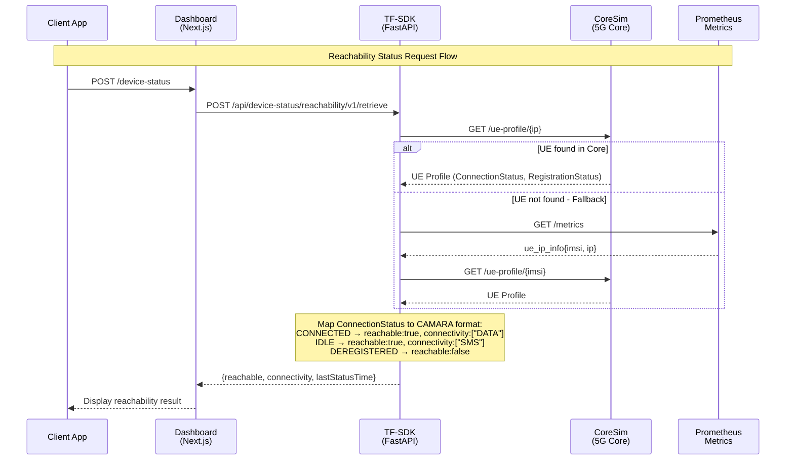

# CAMARA Device Status API Documentation

## Overview

The Device Status API provides CAMARA-compliant endpoints to query device reachability and roaming status. This implementation follows the [CAMARA Device Reachability Status](https://github.com/camaraproject/DeviceStatus) specification.

**Base URL:** `http://localhost:8200/device-status`

---

## Use Cases

### 1. Message Delivery Optimization
**Scenario:** A messaging application needs to decide the best delivery method for a notification.

**How it works:**
- Query reachability status before sending
- If `connectivity: ["DATA"]` → Send rich push notification with images/media
- If `connectivity: ["SMS"]` → Fall back to SMS-only message
- If `reachable: false` → Queue message for later delivery

```bash
# Check if user can receive data
curl -X POST http://localhost:8200/device-status/reachability/v1/retrieve \
  -H "Content-Type: application/json" \
  -d '{"device":{"phoneNumber":"+33612345678"}}'
```

### 2. IoT Device Health Monitoring
**Scenario:** Monitor fleet of IoT sensors/actuators to detect connectivity issues.

**How it works:**
- Periodically poll reachability status of all devices
- Alert operations team when devices go offline (`reachable: false`)
- Track `lastStatusTime` to identify stale connections

```bash
# Monitor IoT device by IP
curl -X POST http://localhost:8200/device-status/reachability/v1/retrieve \
  -H "Content-Type: application/json" \
  -d '{"device":{"ipv4Address":{"publicAddress":"12.1.0.5"}}}'
```

### 3. Roaming Cost Management
**Scenario:** Enterprise wants to warn employees before they incur roaming charges.

**How it works:**
- Check roaming status when corporate app opens
- If `roaming: true` → Display warning about data costs
- Show `countryName` to inform user of their location

```bash
# Check if employee device is roaming
curl -X POST http://localhost:8200/device-status/roaming/v1/retrieve \
  -H "Content-Type: application/json" \
  -d '{"device":{"phoneNumber":"+33612345678"}}'
```

### 4. Location-Based Service Enablement
**Scenario:** Streaming service needs to enforce geo-restrictions.

**How it works:**
- Check roaming status to determine user's current country
- Use `countryCode` to apply regional content licensing rules
- Block or allow content based on location

```json
// Response indicates user is in France
{
  "roaming": true,
  "countryCode": "FR",
  "countryName": ["France"]
}
```

### 5. Emergency Service Routing
**Scenario:** Emergency dispatch system needs to know if a caller's device is reachable.

**How it works:**
- Before dispatching, verify device is still connected
- If unreachable, attempt alternative contact methods
- Use subscription API for real-time status changes

```bash
# Subscribe to reachability changes for emergency device
curl -X POST http://localhost:8200/device-status/reachability/v1/subscriptions \
  -H "Content-Type: application/json" \
  -d '{
    "device": {"phoneNumber": "+33612345678"},
    "sink": "https://emergency-dispatch.example.com/webhook"
  }'
```

### 6. Network Quality-Based App Behavior
**Scenario:** Video conferencing app adjusts quality based on connectivity.

**How it works:**
- Check reachability before starting call
- `DATA` connectivity → Enable HD video
- `SMS` only → Suggest audio-only or reschedule
- Subscribe for changes to dynamically adjust during call

### 7. Fraud Detection
**Scenario:** Banking app detects suspicious location changes.

**How it works:**
- Track roaming status changes for account holders
- Alert when device suddenly appears in unexpected country
- Compare `countryCode` against user's known travel patterns

```bash
# Check if transaction origin matches device location
curl -X POST http://localhost:8200/device-status/roaming/v1/retrieve \
  -H "Content-Type: application/json" \
  -d '{"device":{"ipv4Address":{"publicAddress":"84.125.93.10","publicPort":59765}}}'
```

### 8. Smart Home Automation
**Scenario:** Home automation triggers based on resident's phone connectivity.

**How it works:**
- Subscribe to reachability status of family members' phones
- When all devices become unreachable → Activate "Away" mode (lock doors, set thermostat)
- When any device becomes reachable → Activate "Home" mode

### 9. Fleet Management
**Scenario:** Logistics company tracks driver device connectivity.

**How it works:**
- Monitor reachability of all driver devices
- Identify drivers entering areas with poor coverage
- Route communications appropriately (SMS vs data push)

### 10. Customer Support Optimization
**Scenario:** Support system prioritizes callback based on reachability.

**How it works:**
- Before attempting callback, check if customer is reachable
- If `reachable: false` → Delay callback attempt
- If `connectivity: ["SMS"]` → Send SMS notification instead of call

---

## Sequence Diagrams

### Reachability Status Flow

```
┌─────────┐          ┌───────────┐          ┌─────────┐          ┌──────────┐          ┌─────────┐
│ Client  │          │ Dashboard │          │ TF-SDK  │          │ CoreSim  │          │ Metrics │
│  (App)  │          │  (Next.js)│          │(FastAPI)│          │ (5G Core)│          │(Prometh)│
└────┬────┘          └─────┬─────┘          └────┬────┘          └────┬─────┘          └────┬────┘
     │                     │                     │                    │                     │
     │ POST /reachability  │                     │                    │                     │
     │ ─────────────────►  │                     │                    │                     │
     │                     │                     │                    │                     │
     │                     │ POST /api/device-   │                    │                     │
     │                     │ status/reachability │                    │                     │
     │                     │ ─────────────────►  │                    │                     │
     │                     │                     │                    │                     │
     │                     │                     │ GET /ue-profile    │                     │
     │                     │                     │ ─────────────────► │                     │
     │                     │                     │                    │                     │
     │                     │                     │    (if not found)  │                     │
     │                     │                     │ ───────────────────────────────────────► │
     │                     │                     │                    │  GET /metrics       │
     │                     │                     │                    │  (fallback)         │
     │                     │                     │ ◄─────────────────────────────────────── │
     │                     │                     │                    │  ue_ip_info metrics │
     │                     │                     │                    │                     │
     │                     │                     │ ◄───────────────── │                     │
     │                     │                     │  UE Profile        │                     │
     │                     │                     │  (ConnectionStatus,│                     │
     │                     │                     │   RegistrationStatus)                    │
     │                     │                     │                    │                     │
     │                     │                     │ Map to CAMARA      │                     │
     │                     │                     │ response format    │                     │
     │                     │                     │                    │                     │
     │                     │ ◄───────────────── │                    │                     │
     │                     │ {reachable: true,   │                    │                     │
     │                     │  connectivity:["DATA"]}                  │                     │
     │                     │                     │                    │                     │
     │ ◄───────────────── │                     │                    │                     │
     │ Display result      │                     │                    │                     │
     │                     │                     │                    │                     │
```

### Roaming Status Flow

```
┌─────────┐          ┌───────────┐          ┌─────────┐          ┌──────────┐
│ Client  │          │ Dashboard │          │ TF-SDK  │          │ CoreSim  │
│  (App)  │          │  (Next.js)│          │(FastAPI)│          │ (5G Core)│
└────┬────┘          └─────┬─────┘          └────┬────┘          └────┬─────┘
     │                     │                     │                    │
     │ POST /roaming       │                     │                    │
     │ ─────────────────►  │                     │                    │
     │                     │                     │                    │
     │                     │ POST /api/device-   │                    │
     │                     │ status/roaming      │                    │
     │                     │ ─────────────────►  │                    │
     │                     │                     │                    │
     │                     │                     │ GET /ue-profile    │
     │                     │                     │ ─────────────────► │
     │                     │                     │                    │
     │                     │                     │ ◄───────────────── │
     │                     │                     │  UE Profile        │
     │                     │                     │  (Plmn: {mcc, mnc})│
     │                     │                     │                    │
     │                     │                     │ Compare with       │
     │                     │                     │ HOME_PLMN          │
     │                     │                     │ (001/06)           │
     │                     │                     │                    │
     │                     │                     │ Lookup MCC →       │
     │                     │                     │ Country Code/Name  │
     │                     │                     │                    │
     │                     │ ◄───────────────── │                    │
     │                     │ {roaming: false,    │                    │
     │                     │  countryCode: "XX", │                    │
     │                     │  countryName:["Test"]}                   │
     │                     │                     │                    │
     │ ◄───────────────── │                     │                    │
     │ Display result      │                     │                    │
     │                     │                     │                    │
```

### Subscription & Webhook Flow

```
┌─────────┐          ┌─────────┐          ┌──────────┐          ┌─────────┐
│ Client  │          │ TF-SDK  │          │ CoreSim  │          │ Webhook │
│  (App)  │          │(FastAPI)│          │ (5G Core)│          │ Server  │
└────┬────┘          └────┬────┘          └────┬─────┘          └────┬────┘
     │                    │                    │                     │
     │ POST /subscriptions│                    │                     │
     │ {device, sink}     │                    │                     │
     │ ─────────────────► │                    │                     │
     │                    │                    │                     │
     │                    │ Store subscription │                     │
     │                    │ in memory/Redis    │                     │
     │                    │                    │                     │
     │ ◄───────────────── │                    │                     │
     │ {subscriptionId,   │                    │                     │
     │  expiresAt}        │                    │                     │
     │                    │                    │                     │
     │                    │                    │                     │
     ═══════════════════════════════════════════════════════════════════
                         TIME PASSES - STATUS CHANGES
     ═══════════════════════════════════════════════════════════════════
     │                    │                    │                     │
     │                    │ ◄───────────────── │                     │
     │                    │ Status Change Event│                     │
     │                    │ (UE disconnected)  │                     │
     │                    │                    │                     │
     │                    │ Match subscription │                     │
     │                    │ for device         │                     │
     │                    │                    │                     │
     │                    │ POST CloudEvent    │                     │
     │                    │ ──────────────────────────────────────►  │
     │                    │                    │  {eventType:        │
     │                    │                    │   "reachability-    │
     │                    │                    │    status-changed", │
     │                    │                    │   reachable: false} │
     │                    │                    │                     │
     │                    │ ◄────────────────────────────────────── │
     │                    │                    │  200 OK             │
     │                    │                    │                     │
```

### Mermaid Diagram (for GitHub/GitLab rendering)



### Component Architecture

```
┌────────────────────────────────────────────────────────────────────────────┐
│                              CAMARA Dashboard                               │
│                           (http://localhost:3100)                          │
│  ┌─────────────────────────────────────────────────────────────────────┐  │
│  │                      Device Status Page                              │  │
│  │  ┌─────────────────┐  ┌─────────────────┐  ┌─────────────────────┐  │  │
│  │  │ UE Selector     │  │ Reachability Tab│  │ Roaming Tab         │  │  │
│  │  │ (from CoreSim)  │  │ • Get Status    │  │ • Get Status        │  │  │
│  │  │                 │  │ • Show Result   │  │ • Show Country      │  │  │
│  │  └─────────────────┘  └─────────────────┘  └─────────────────────┘  │  │
│  └─────────────────────────────────────────────────────────────────────┘  │
└────────────────────────────────────────────────────────────────────────────┘
                                      │
                                      ▼
┌────────────────────────────────────────────────────────────────────────────┐
│                               TF-SDK API                                    │
│                           (http://localhost:8200)                          │
│  ┌─────────────────────────────────────────────────────────────────────┐  │
│  │                    camara_device_status.py                           │  │
│  │  ┌───────────────────────┐  ┌───────────────────────┐               │  │
│  │  │ /reachability/v1/     │  │ /roaming/v1/          │               │  │
│  │  │ retrieve              │  │ retrieve              │               │  │
│  │  │ • Resolve device IP   │  │ • Resolve device IP   │               │  │
│  │  │ • Get UE profile      │  │ • Get UE profile      │               │  │
│  │  │ • Map to CAMARA       │  │ • Check PLMN vs HOME  │               │  │
│  │  │ • Return response     │  │ • Return response     │               │  │
│  │  └───────────────────────┘  └───────────────────────┘               │  │
│  └─────────────────────────────────────────────────────────────────────┘  │
│                                      │                                     │
│  ┌─────────────────────────────────────────────────────────────────────┐  │
│  │                    CoreSim Client (coresim/client.py)                │  │
│  │  • get_ue_profile_by_ip()                                            │  │
│  │  • get_device_reachability_status()                                  │  │
│  │  • get_device_roaming_status()                                       │  │
│  │  • _get_ue_profile_from_metrics() [fallback]                         │  │
│  └─────────────────────────────────────────────────────────────────────┘  │
└────────────────────────────────────────────────────────────────────────────┘
                                      │
                    ┌─────────────────┼─────────────────┐
                    ▼                 ▼                 ▼
┌──────────────────────┐  ┌──────────────────┐  ┌──────────────────────┐
│      CoreSim         │  │ UE Identity Svc  │  │    Prometheus        │
│  (http://localhost   │  │ (Redis-backed)   │  │ (http://localhost    │
│   :9090)             │  │                  │  │  :9090/metrics)      │
│                      │  │                  │  │                      │
│ • UE Registration    │  │ • SUPI → IP map  │  │ • ue_ip_info metric  │
│ • PDU Sessions       │  │ • MSISDN lookup  │  │ • UE status metrics  │
│ • PLMN Info          │  │                  │  │                      │
└──────────────────────┘  └──────────────────┘  └──────────────────────┘
```

### Status Mapping Logic

```
┌─────────────────────────────────────────────────────────────────────────┐
│                    CoreSim UE Profile                                    │
│  {                                                                       │
│    "RegistrationStatus": "REGISTERED" | "DEREGISTERED",                 │
│    "ConnectionStatus": "CONNECTED" | "IDLE" | "DISCONNECTED",           │
│    "PduSessions": {...},                                                │
│    "Plmn": {"mcc": "001", "mnc": "06"}                                  │
│  }                                                                       │
└─────────────────────────────────────────────────────────────────────────┘
                                   │
                                   ▼
┌─────────────────────────────────────────────────────────────────────────┐
│                    Reachability Mapping                                  │
│                                                                          │
│  RegistrationStatus = DEREGISTERED                                       │
│         │                                                                │
│         ▼                                                                │
│  ┌─────────────────────────────────────────┐                            │
│  │ reachable: false                        │                            │
│  │ connectivity: null                      │                            │
│  └─────────────────────────────────────────┘                            │
│                                                                          │
│  RegistrationStatus = REGISTERED                                         │
│         │                                                                │
│         ├─── ConnectionStatus = CONNECTED + PduSessions > 0             │
│         │           │                                                    │
│         │           ▼                                                    │
│         │    ┌─────────────────────────────────────────┐                │
│         │    │ reachable: true                         │                │
│         │    │ connectivity: ["DATA"]                  │                │
│         │    └─────────────────────────────────────────┘                │
│         │                                                                │
│         └─── ConnectionStatus = CONNECTED (no PDU) or IDLE              │
│                     │                                                    │
│                     ▼                                                    │
│              ┌─────────────────────────────────────────┐                │
│              │ reachable: true                         │                │
│              │ connectivity: ["SMS"]                   │                │
│              └─────────────────────────────────────────┘                │
└─────────────────────────────────────────────────────────────────────────┘

┌─────────────────────────────────────────────────────────────────────────┐
│                    Roaming Mapping                                       │
│                                                                          │
│  HOME_PLMN = {mcc: "001", mnc: "06"}                                    │
│                                                                          │
│  UE PLMN.mcc == HOME_PLMN.mcc && UE PLMN.mnc == HOME_PLMN.mnc          │
│         │                                                                │
│         ├─── YES ───►  roaming: false                                   │
│         │              countryCode: from MCC_COUNTRY_MAP                │
│         │                                                                │
│         └─── NO ────►  roaming: true                                    │
│                        countryCode: from MCC_COUNTRY_MAP[ue.plmn.mcc]   │
│                        countryName: ["France", "Germany", etc.]         │
└─────────────────────────────────────────────────────────────────────────┘
```

---

## API Endpoints

### 1. Device Reachability Status

Check if a device is reachable from the network via data or SMS connectivity.

#### Endpoint
```
POST /device-status/reachability/v1/retrieve
```

#### Request Headers
| Header | Type | Required | Description |
|--------|------|----------|-------------|
| `Content-Type` | string | Yes | Must be `application/json` |
| `x-correlator` | string | No | Correlation ID for request tracing (UUID format) |

#### Query Parameters
| Parameter | Type | Required | Description |
|-----------|------|----------|-------------|
| `core` | string | No | Target 5G core (default: `coresim`) |
| `device_ip` | string | No | Device IP for demo mode bypass |

#### Request Body
```json
{
  "device": {
    "ipv4Address": {
      "publicAddress": "12.1.0.1",
      "privateAddress": "10.0.0.1",  // optional
      "publicPort": 59765            // optional
    },
    "phoneNumber": "+33612345678",   // optional, E.164 format
    "networkAccessIdentifier": "user@domain.com",  // optional
    "ipv6Address": "2001:db8::1"     // optional
  }
}
```

> **Note:** Per CAMARA spec:
> - With **2-legged access token**: `device` parameter is **required**
> - With **3-legged access token**: `device` parameter must **not** be provided (identified from token)

#### Response (200 OK)
```json
{
  "device": {
    "ipv4Address": {
      "publicAddress": "12.1.0.1"
    }
  },
  "lastStatusTime": "2026-01-07T10:41:38.657Z",
  "reachable": true,
  "connectivity": ["DATA"],
  "reachabilityStatus": "CONNECTED_DATA"
}
```

#### Response Fields
| Field | Type | Required | Description |
|-------|------|----------|-------------|
| `device` | object | No | Returned only when device was provided in request (2-legged token) |
| `lastStatusTime` | string | Yes | RFC 3339 timestamp of last confirmed status |
| `reachable` | boolean | Yes | `true` if device is reachable, `false` otherwise |
| `connectivity` | array | No | Present only when `reachable=true`. Values: `["DATA"]`, `["SMS"]`, or `["DATA", "SMS"]` |
| `reachabilityStatus` | string | No | Legacy field for backwards compatibility |

#### Connectivity Types
| Value | Description |
|-------|-------------|
| `DATA` | Device is connected for data usage (full connectivity) |
| `SMS` | Device is connected only for SMS usage |

#### Example: Device Reachable with Data
```bash
curl -X POST http://localhost:8200/device-status/reachability/v1/retrieve \
  -H "Content-Type: application/json" \
  -d '{
    "device": {
      "ipv4Address": {
        "publicAddress": "12.1.0.1"
      }
    }
  }'
```

Response:
```json
{
  "lastStatusTime": "2026-01-07T10:41:38.657Z",
  "reachable": true,
  "connectivity": ["DATA"],
  "reachabilityStatus": "CONNECTED_DATA"
}
```

#### Example: Device Not Reachable
```json
{
  "lastStatusTime": "2026-01-07T10:41:38.657Z",
  "reachable": false
}
```

---

### 2. Device Roaming Status

Check if a device is currently roaming and in which country.

#### Endpoint
```
POST /device-status/roaming/v1/retrieve
```

#### Request Headers
| Header | Type | Required | Description |
|--------|------|----------|-------------|
| `Content-Type` | string | Yes | Must be `application/json` |
| `x-correlator` | string | No | Correlation ID for request tracing |

#### Query Parameters
| Parameter | Type | Required | Description |
|-----------|------|----------|-------------|
| `core` | string | No | Target 5G core (default: `coresim`) |
| `device_ip` | string | No | Device IP for demo mode bypass |

#### Request Body
```json
{
  "device": {
    "ipv4Address": {
      "publicAddress": "12.1.0.1"
    }
  }
}
```

#### Response (200 OK)
```json
{
  "roaming": false,
  "countryCode": "XX",
  "countryName": ["Test Network"]
}
```

#### Response Fields
| Field | Type | Required | Description |
|-------|------|----------|-------------|
| `roaming` | boolean | Yes | `true` if device is roaming, `false` if on home network |
| `countryCode` | string | No | ISO 3166-1 alpha-2 country code (or MCC) |
| `countryName` | array | No | Country name(s) where device is located |

#### Example: Device on Home Network
```bash
curl -X POST http://localhost:8200/device-status/roaming/v1/retrieve \
  -H "Content-Type: application/json" \
  -d '{
    "device": {
      "ipv4Address": {
        "publicAddress": "12.1.0.1"
      }
    }
  }'
```

Response:
```json
{
  "roaming": false,
  "countryCode": "XX",
  "countryName": ["Test Network"]
}
```

#### Example: Device Roaming
```json
{
  "roaming": true,
  "countryCode": "FR",
  "countryName": ["France"]
}
```

---

### 3. Reachability Status Subscription

Subscribe to receive webhook notifications when device connectivity status changes.

#### Endpoint
```
POST /device-status/reachability/v1/subscriptions
```

#### Request Body
```json
{
  "device": {
    "ipv4Address": {
      "publicAddress": "12.1.0.1"
    }
  },
  "sink": "https://your-webhook.com/notifications",
  "sinkCredential": {
    "credentialType": "ACCESSTOKEN",
    "accessToken": "your-token"
  },
  "subscriptionExpireTime": "2026-01-08T10:00:00Z",
  "subscriptionMaxEvents": 100
}
```

#### Response (201 Created)
```json
{
  "subscriptionId": "550e8400-e29b-41d4-a716-446655440000",
  "device": {
    "ipv4Address": {
      "publicAddress": "12.1.0.1"
    }
  },
  "sink": "https://your-webhook.com/notifications",
  "startsAt": "2026-01-07T10:00:00Z",
  "expiresAt": "2026-01-08T10:00:00Z"
}
```

---

### 4. Roaming Status Subscription

Subscribe to receive webhook notifications when device roaming status changes.

#### Endpoint
```
POST /device-status/roaming/v1/subscriptions
```

#### Request/Response
Same structure as reachability subscriptions.

---

### 5. Get Subscription

Retrieve details of an existing subscription.

#### Endpoint
```
GET /device-status/reachability/v1/subscriptions/{subscriptionId}
GET /device-status/roaming/v1/subscriptions/{subscriptionId}
```

---

### 6. Delete Subscription

Cancel an existing subscription.

#### Endpoint
```
DELETE /device-status/reachability/v1/subscriptions/{subscriptionId}
DELETE /device-status/roaming/v1/subscriptions/{subscriptionId}
```

#### Response (204 No Content)
No response body on success.

---

## Error Responses

All error responses follow the CAMARA standard format:

```json
{
  "status": 404,
  "code": "IDENTIFIER_NOT_FOUND",
  "message": "The device identifier provided is not associated with a customer account"
}
```

### Error Codes

| HTTP Status | Code | Description |
|-------------|------|-------------|
| 400 | `INVALID_ARGUMENT` | Invalid request syntax or parameters |
| 401 | `UNAUTHENTICATED` | Missing or invalid authentication |
| 403 | `PERMISSION_DENIED` | Insufficient permissions |
| 404 | `NOT_FOUND` | Resource not found |
| 404 | `IDENTIFIER_NOT_FOUND` | Device identifier not associated with customer |
| 422 | `MISSING_IDENTIFIER` | Device cannot be identified (no device provided and not identifiable from token) |
| 422 | `UNNECESSARY_IDENTIFIER` | Device provided but already identified from 3-legged token |
| 422 | `UNSUPPORTED_IDENTIFIER` | Provided identifier type not supported |
| 422 | `SERVICE_NOT_APPLICABLE` | Service not available for the identifier |
| 429 | `QUOTA_EXCEEDED` | Business quota limit exceeded |
| 429 | `TOO_MANY_REQUESTS` | Rate limit exceeded |
| 500 | `INTERNAL` | Internal server error |
| 503 | `UNAVAILABLE` | Service temporarily unavailable |

---

## Device Identification

Devices can be identified using any of the following identifiers:

| Identifier | Format | Example |
|------------|--------|---------|
| `phoneNumber` | E.164 format | `+33612345678` |
| `ipv4Address.publicAddress` | IPv4 dotted-quad | `84.125.93.10` |
| `ipv4Address.privateAddress` | IPv4 dotted-quad | `10.0.0.1` |
| `ipv4Address.publicPort` | 0-65535 | `59765` |
| `ipv6Address` | IPv6 format | `2001:db8:85a3::7344` |
| `networkAccessIdentifier` | NAI format | `user@domain.com` |

> **Note:** In general, mobile devices cannot be identified by public IPv4 address alone. Include at least one of `privateAddress` or `publicPort`.

---

## x-correlator Header

The `x-correlator` header is used for request tracing across services.

- **Format:** `^[a-zA-Z0-9-_:;.\/<>{}]{0,256}$`
- **Example:** `b4333c46-49c0-4f62-80d7-f0ef930f1c46`
- If not provided in the request, a UUID will be generated
- Always returned in the response

---

## Dashboard Integration

The Device Status API is integrated into the CAMARA Dashboard at:
```
http://localhost:3100/device-status
```

Features:
- Select UE from CoreSim
- Test Reachability Status
- Test Roaming Status
- View raw JSON responses
- Network flow visualization

---

## Configuration

Environment variables:

| Variable | Default | Description |
|----------|---------|-------------|
| `HOME_MCC` | `001` | Home network Mobile Country Code |
| `HOME_MNC` | `06` | Home network Mobile Network Code |

---

## CAMARA Compliance

This implementation follows:
- **CAMARA Device Reachability Status API** (vwip)
- **CAMARA Commonalities** v0.6
- **RFC 3339** for timestamps

### Specification Reference
- [CAMARA DeviceStatus GitHub](https://github.com/camaraproject/DeviceStatus)
- [OpenAPI Spec](https://github.com/camaraproject/DeviceStatus/blob/main/code/API_definitions/device-reachability-status.yaml)
