# CAMARA SIM Swap API Documentation

## Overview

The SIM Swap API is a CAMARA-compliant implementation that provides information about SIM swap events for mobile phone numbers. This API is essential for **fraud prevention** by detecting recent SIM swaps that could indicate account takeover attempts.

**Specification**: [CAMARA SimSwap API](https://github.com/camaraproject/SimSwap)

**Version**: vwip (work in progress)

**Base Path**: `/sim-swap/vwip`

---

## Architecture

### Component Diagram


### Sequence Diagram - Check SIM Swap


### Sequence Diagram - Retrieve SIM Swap Date


### Error Handling Flow


### Fraud Detection Decision Flow

```plantuml
@startuml Fraud Detection Flow
!theme plain
skinparam backgroundColor #FEFEFE

title SIM Swap Fraud Detection - Decision Flow

start

:Receive transaction/login request;

:Call SIM Swap API\nPOST /sim-swap/vwip/check;

if (API Response?) then (swapped: true)
    :Get swap timestamp\nPOST /retrieve-date;
    
    if (Swap < 24 hours?) then (yes)
        #FF6B6B:🚨 CRITICAL RISK;
        :Block operation;
        :Require in-person verification;
        stop
    elseif (Swap < 72 hours?) then (yes)
        #FFA500:🔴 HIGH RISK;
        :Require step-up auth;
        :Notify via alternate channel;
    elseif (Swap < 7 days?) then (yes)
        #FFD93D:🟠 MEDIUM RISK;
        :Add friction/delays;
        :Log for review;
    else (> 7 days)
        #90EE90:🟡 ELEVATED;
        :Proceed with monitoring;
    endif
else (swapped: false)
    #90EE90:✅ LOW RISK;
    :Proceed normally;
endif

:Complete operation;

stop

@enduml
```



### Data Model


---

```

## API Endpoints

### 1. Check SIM Swap

Check if a SIM swap has occurred within a specified time period.

**Endpoint**: `POST /sim-swap/vwip/check`

#### Request

```json
{
  "phoneNumber": "+33600000001",
  "maxAge": 240
}
```

| Field | Type | Required | Description |
|-------|------|----------|-------------|
| `phoneNumber` | string | Yes* | Phone number in E.164 format (e.g., `+346661113334`) |
| `maxAge` | integer | No | Period in hours to check for SIM swap (1-2400, default: 240) |

*Required for 2-legged authentication. For 3-legged flows, derived from access token.

#### Response

**Success (200)**:
```json
{
  "swapped": true
}
```

| Field | Type | Description |
|-------|------|-------------|
| `swapped` | boolean | `true` if SIM was swapped within `maxAge` hours, `false` otherwise |

#### Example

```bash
curl -X POST http://localhost:8200/sim-swap/vwip/check \
  -H "Content-Type: application/json" \
  -H "x-correlator: my-correlation-id-123" \
  -d '{
    "phoneNumber": "+33600000001",
    "maxAge": 48
  }'
```

---

### 2. Retrieve SIM Swap Date

Get the timestamp of the latest SIM swap event.

**Endpoint**: `POST /sim-swap/vwip/retrieve-date`

#### Request

```json
{
  "phoneNumber": "+33600000001"
}
```

| Field | Type | Required | Description |
|-------|------|----------|-------------|
| `phoneNumber` | string | Yes* | Phone number in E.164 format |

#### Response

**Success (200)** - Swap within monitored period:
```json
{
  "latestSimChange": "2024-09-18T07:37:53.471Z",
  "monitoredPeriod": null
}
```

**Success (200)** - Swap outside monitored period or no data:
```json
{
  "latestSimChange": null,
  "monitoredPeriod": 120
}
```

| Field | Type | Description |
|-------|------|-------------|
| `latestSimChange` | string (ISO 8601) \| null | Timestamp of last SIM swap, or `null` if outside monitored period |
| `monitoredPeriod` | integer \| null | Days of monitoring period (returned when `latestSimChange` is null) |

#### Example

```bash
curl -X POST http://localhost:8200/sim-swap/vwip/retrieve-date \
  -H "Content-Type: application/json" \
  -d '{
    "phoneNumber": "+33600000001"
  }'
```

---

## Error Responses

All error responses follow the CAMARA standard format:

```json
{
  "status": 422,
  "code": "MISSING_IDENTIFIER",
  "message": "The device cannot be identified. Provide phoneNumber in request body."
}
```

### Error Codes

| Status | Code | Description |
|--------|------|-------------|
| 400 | `INVALID_ARGUMENT` | Invalid phone number format or parameter |
| 400 | `OUT_OF_RANGE` | `maxAge` exceeds operator's monitored period |
| 401 | `UNAUTHORIZED` | Missing or invalid authentication |
| 403 | `FORBIDDEN` | Insufficient permissions |
| 404 | `NOT_FOUND` | Subscriber not found |
| 422 | `MISSING_IDENTIFIER` | Phone number required but not provided |
| 429 | `TOO_MANY_REQUESTS` | Rate limit exceeded |
| 500 | `INTERNAL_SERVER_ERROR` | Server error |

---

## Headers

### Request Headers

| Header | Required | Description |
|--------|----------|-------------|
| `Content-Type` | Yes | Must be `application/json` |
| `x-correlator` | No | Correlation ID for request tracing (UUID format) |
| `Authorization` | No | Bearer token for 3-legged authentication |

### Response Headers

| Header | Description |
|--------|-------------|
| `x-correlator` | Echo of request correlator or auto-generated UUID |

---

## Authentication Flows

### 2-Legged Authentication (Server-to-Server)

- `phoneNumber` **must** be provided in the request body
- Used for backend service-to-service calls
- API identifies subscriber by provided phone number

```json
{
  "phoneNumber": "+33600000001",
  "maxAge": 240
}
```

### 3-Legged Authentication (User Consent)

- `phoneNumber` is derived from the OAuth access token
- `phoneNumber` **must NOT** be in the request body
- Used when end-user has granted consent via OAuth flow

```bash
curl -X POST http://localhost:8200/sim-swap/vwip/check \
  -H "Authorization: Bearer <access_token>" \
  -H "Content-Type: application/json" \
  -d '{
    "maxAge": 48
  }'
```

---

## Risk Levels

The API internally categorizes SIM swap risk based on recency:

| Risk Level | Time Since Swap | Fraud Indicator |
|------------|-----------------|-----------------|
| 🚨 **HIGH** | < 48 hours | Critical - likely fraud attempt |
| ⚠️ **MEDIUM** | 2-14 days | Elevated - investigate further |
| ⚡ **ELEVATED** | 15-60 days | Low concern - recent activation |
| ✅ **LOW** | > 60 days | Normal - no recent swap |

---

## Configuration

### Environment Variables

| Variable | Default | Description |
|----------|---------|-------------|
| `SIM_SWAP_MONITORED_DAYS` | 120 | Operator policy: max days to retain SIM swap history |

### Operator Limits

- **Monitored Period**: 120 days (configurable)
- **Max Age Limit**: `maxAge` cannot exceed `MONITORED_PERIOD_DAYS * 24` hours
- Requests exceeding this limit return `400 OUT_OF_RANGE`

---

## Demo/Testing Endpoints

### Simulate SIM Swap

For testing purposes, simulate a SIM swap event:

**Endpoint**: `POST /sim-swap/vwip/demo/simulate-swap`

```bash
curl -X POST "http://localhost:8200/sim-swap/vwip/demo/simulate-swap?phone_number=%2B33600000001&hours_ago=24"
```

| Parameter | Type | Description |
|-----------|------|-------------|
| `phone_number` | string | Phone number in E.164 format |
| `hours_ago` | integer | How many hours ago the swap occurred (default: 0 = now) |

### View SIM Swap Database

View current SIM swap cache (demo only):

**Endpoint**: `GET /sim-swap/vwip/demo/database`

---

## Integration with NEF Services

### ue-profile-service

The SIM Swap API queries `ue-profile-service` to:
1. Resolve MSISDN (phone number) to SUPI (subscriber ID)
2. Retrieve subscriber profile data
3. Derive SIM swap information from profile attributes

### Redis Cache

UE profile data is cached in Redis, populated by CoreSim:
- Key pattern: `ue:{supi}`
- Contains: IMSI, MSISDN, registration status, IP address, etc.

### CoreSim Integration

CoreSim publishes UE lifecycle events that update Redis:
- UE Registration → Profile created/updated
- UE Deregistration → Profile status updated
- MSISDN generated as: `+336{last 8 digits of IMSI}`

---

## Use Cases

| Use Case | Industry | API Call | Decision Logic | Action on `swapped: true` |
|----------|----------|----------|----------------|---------------------------|
| **High-Value Transaction Authorization** | Banking/Finance | `POST /check` with `maxAge: 24` | Block if SIM swapped in last 24 hours | Require in-branch verification or video KYC |
| **Account Password Reset** | All Industries | `POST /check` with `maxAge: 72` | Flag if SIM swapped in last 3 days | Use email verification instead of SMS OTP |
| **New Device Login** | E-commerce/SaaS | `POST /check` with `maxAge: 48` | Add to risk score if recent swap | Trigger step-up authentication (MFA) |
| **Wire Transfer Approval** | Banking | `POST /retrieve-date` | Check exact swap timestamp | Delay transfer 24-48 hours for review |
| **SIM-Based 2FA Enrollment** | Security | `POST /check` with `maxAge: 168` | Prevent enrollment if swapped in 7 days | Wait or use hardware token instead |
| **Account Recovery via SMS** | Social Media | `POST /check` with `maxAge: 240` | Block SMS recovery if recent swap | Force email or security questions |
| **Loan Application Verification** | Fintech | `POST /retrieve-date` | Review swap history for fraud patterns | Manual review if swap < 30 days |
| **Phone Number Change Request** | Telecom | `POST /check` with `maxAge: 24` | Verify legitimacy of change request | Require additional ID verification |
| **Insurance Claim Processing** | Insurance | `POST /retrieve-date` | Check if swap coincides with claim date | Flag for fraud investigation |
| **Cryptocurrency Withdrawal** | Crypto/Web3 | `POST /check` with `maxAge: 48` | High-risk if recent swap detected | Enforce 48-hour withdrawal hold |

### Risk-Based Decision Matrix

| Swap Recency | Risk Level | Recommended Action |
|--------------|------------|-------------------|
| < 24 hours | 🚨 **CRITICAL** | Block sensitive operations, require in-person verification |
| 24-72 hours | 🔴 **HIGH** | Require step-up authentication, notify user via alternate channel |
| 3-7 days | 🟠 **MEDIUM** | Add friction (delays, additional questions), log for review |
| 7-30 days | 🟡 **ELEVATED** | Monitor closely, may proceed with extra logging |
| > 30 days | 🟢 **LOW** | Normal operations, standard security measures |

### Example API Calls by Use Case

| Use Case | curl Command |
|----------|--------------|
| Transaction Check | `curl -X POST http://localhost:8200/sim-swap/vwip/check -H "Content-Type: application/json" -d '{"phoneNumber": "+33600000001", "maxAge": 24}'` |
| Get Swap Date | `curl -X POST http://localhost:8200/sim-swap/vwip/retrieve-date -H "Content-Type: application/json" -d '{"phoneNumber": "+33600000001"}'` |
| Login Risk Check | `curl -X POST http://localhost:8200/sim-swap/vwip/check -H "Content-Type: application/json" -d '{"phoneNumber": "+33600000001", "maxAge": 72}'` |

---

## OpenAPI Specification

The full OpenAPI 3.0 specification is available at:
- **Swagger UI**: `http://localhost:8200/docs#/CAMARA%20SIM%20Swap`
- **OpenAPI JSON**: `http://localhost:8200/openapi.json`

---

## References

- [CAMARA SimSwap API Specification](https://github.com/camaraproject/SimSwap)
- [CAMARA Common Guidelines](https://github.com/camaraproject/Commonalities)
- [E.164 Phone Number Format](https://www.itu.int/rec/T-REC-E.164)

---

## Version History

| Version | Date | Changes |
|---------|------|---------|
| vwip | 2026-01-14 | Initial implementation with NEF integration |
